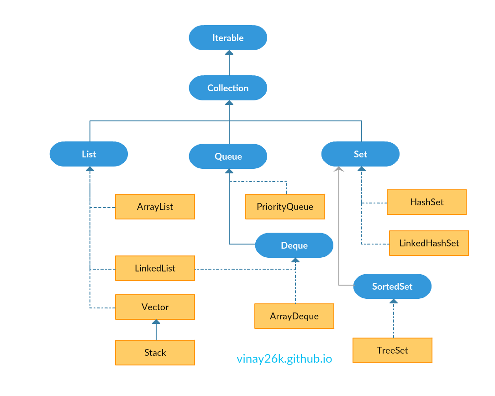

# github.com/Vinay26k
## [Resume](https://vinay26k.github.io/Resume.html)
## Java Collections Framework - Complete Tutorials by Me [In process]




### Iterable Interface
	- On javap java.lang.Iterable
<<<<<<< HEAD
```java
	Compiled from "Iterable.java"
	public interface java.lang.Iterable<T> {
		public abstract java.util.Iterator<T> iterator();
		public void forEach(java.util.function.Consumer<? super T>);
		public java.util.Spliterator<T> spliterator();
	}
```
=======
		````java
		Compiled from "Iterable.java"
			public interface java.lang.Iterable<T> {
				public abstract java.util.Iterator<T> iterator();
				public void forEach(java.util.function.Consumer<? super T>);
				public java.util.Spliterator<T> spliterator();
			}
		```
>>>>>>> 8395b35ad9e0c255bc3ecdae685fcad1325d0769

	- Key things to Note:
		- It has Iterator interface in it
		- forEach method
		- It also has Spliterator interface
			- which is combination of splitting + iterator
			- it provides tryAdvance() method which is equivalent to both next() and hasNext() from iterator
			- it can't be used on Map data structure


### Iterator Interface

	- On javap java.util.Iterator
```java
	Compiled from "Iterator.java"
	public interface java.util.Iterator<E> {
  		public abstract boolean hasNext();
  		public abstract E next();
  		public void remove();
  		public void forEachRemaining(java.util.function.Consumer<? super E>);
	}
```

	- Key things to Note:
		- hasNext() => checks whether element exists next in the sequence or not
		- next()  => returns the element and moves iterator/ cursor point to next element
		- remove() => removes last element returned by iterator
		- forEachRemaining() => Performs the given action for each remaining element until all elements have been processed or the action throws an exception.


### Spliterator Interface

	-On javap java.util.Spliterator
```java
	Compiled from "Spliterator.java"
	public interface java.util.Spliterator<T> {
		public static final int ORDERED;
		public static final int DISTINCT;
		public static final int SORTED;
		public static final int SIZED;
		public static final int NONNULL;
		public static final int IMMUTABLE;
		public static final int CONCURRENT;
		public static final int SUBSIZED;
		public abstract boolean tryAdvance(java.util.function.Consumer<? super T>);
		public void forEachRemaining(java.util.function.Consumer<? super T>);
		public abstract java.util.Spliterator<T> trySplit();
		public abstract long estimateSize();
 		public long getExactSizeIfKnown();
		public abstract int characteristics();
		public boolean hasCharacteristics(int);
		public java.util.Comparator<? super T> getComparator();
	}
```

	- Key things to Note:
		- SIZED – if it’s capable of returning an exact numer of elements with the estimateSize() method
		- SORTED – if it’s iterating through a sorted source
		- SUBSIZED – if we split the instance using a trySplit() method and obtain Spliterators that are SIZED as well
		- CONCURRENT – if source can be safely modified concurrently
		- DISTINCT – if for each pair of encountered elements x, y, !x.equals(y)
		- IMMUTABLE – if elements held by source can’t be structurally modified
		- NONNULL – if source holds nulls or not
		- ORDERED – if iterating over an ordered sequence


### Collection interface:

	- it defines all the methods inherited by other collections
	-on javap java.util.Collection
```java
	Compiled from "Collection.java"
	public interface java.util.Collection<E> extends java.lang.Iterable<E> {
  		public abstract int size();
  		public abstract boolean isEmpty();
  		public abstract boolean contains(java.lang.Object);
  		public abstract java.util.Iterator<E> iterator();
  		public abstract java.lang.Object[] toArray();
  		public abstract <T> T[] toArray(T[]);
  		public abstract boolean add(E);
  		public abstract boolean remove(java.lang.Object);
  		public abstract boolean containsAll(java.util.Collection<?>);
  		public abstract boolean addAll(java.util.Collection<? extends E>);
  		public abstract boolean removeAll(java.util.Collection<?>);
  		public boolean removeIf(java.util.function.Predicate<? super E>);
  		public abstract boolean retainAll(java.util.Collection<?>);
  		public abstract void clear();
  		public abstract boolean equals(java.lang.Object);
  		public abstract int hashCode();
  		public java.util.Spliterator<E> spliterator();
  		public java.util.stream.Stream<E> stream();
  		public java.util.stream.Stream<E> parallelStream();
	}
```

	- Key things to Note:
		- size() - size of the collection
		- isEmpty() - check empty or not
		- contains() - check if contains element
		- (Iterator) iterator() -> implements hasNext(), next(), remove(), forEachRemaining()
		- toArray() - convert collection to array
		- add() - add element to collection
		- remove() - remove element from collection
		- containsAll() - check if some collection is present
		- addAll() -  add one collection to other
		- removeAll() - remove the passed collection elements from collection
		- removeIf() - checks condition and removes element
		- retainAll() - keep common elements from passed collection
		- clear() - clear the collection
		- equals() - check if one object equals to other
		- hashCode() - returns hashCode for each object
		- (Spliterator) spliterator() -> implements trySplit(), tryAdvance(), forEachRemaining()..
		- (java.util.stream.Stream) stream() -> stream object to perform stream operations
		- parallelStream() -> similar to stream object
